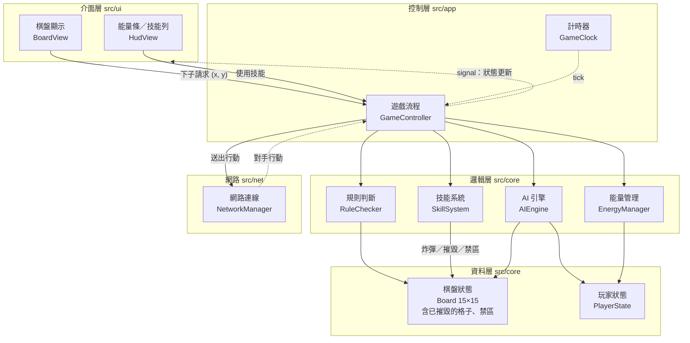
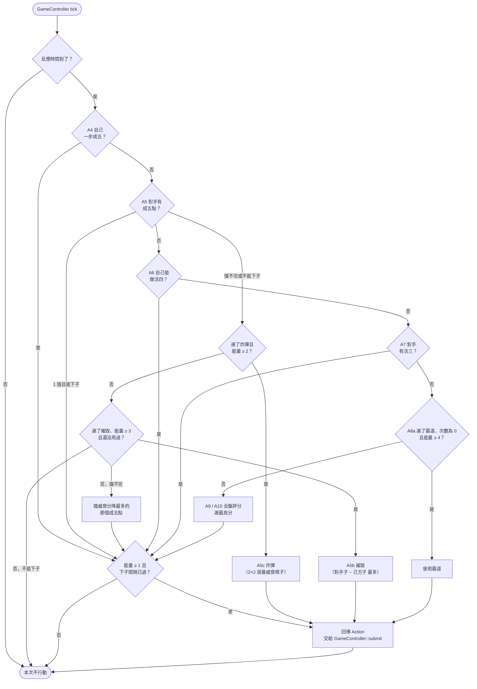

> 本文件說明「怎麼做」：架構、類別介面、資料流。規則細節以 `docs/spec.md` 為準。

---

## 1. 技術選型

|項目|選擇|
|---|---|
|語言|C++17|
|GUI / 網路|Qt 6（Core、Widgets、Network）|
|建置|CMake ≥ 3.21|
|測試|GoogleTest（用 CMake `FetchContent` 取得）|
|版本控制 / CI|Git、GitHub Actions|

---

## 2. 架構



實線：呼叫（上層依賴下層）　虛線：signal 通知

### 2.1 分層規則（必須遵守）

|層|目錄|可以依賴|不可以依賴|
|---|---|---|---|
|邏輯層 + 資料層|`src/core`|C++ 標準函式庫|**任何 Qt**、系統時間、亂數裝置|
|網路|`src/net`|`src/core`、QtCore、QtNetwork|QtWidgets|
|控制層|`src/app`|`src/core`、`src/net`、QtCore|QtWidgets|
|介面層|`src/ui`|以上全部、QtWidgets|—|

原本的架構圖把 NetworkManager 畫在邏輯層。因為它需要 QtNetwork，實作上獨立放在 `src/net`，好讓 `src/core` 維持完全不依賴 Qt。

這樣分層的好處：`src/core` 是純 C++，時間和亂數都從外部傳入，所以測試完全可以重現，也不需要開視窗。

---

## 3. 核心型別（`src/core/types.h`）

```cpp
using TimeMs = std::int64_t;              // 對局時間（毫秒），由呼叫端傳入

enum class PlayerId : std::uint8_t { Black = 0, White = 1 };
inline PlayerId opponent(PlayerId p);

enum class Cell : std::uint8_t { Empty, Black, White, Destroyed };   // spec B2、B4

struct Pos { int x; int y; };             // 0–14

enum class SkillId : std::uint8_t { Bomb, Dominate, Destroy };   // spec S1（加速已刪除）

enum class RejectReason : std::uint8_t {
    GameNotRunning, OutOfBoard, DestroyedCell, Occupied, RestrictedZone,
    PlaceCooldown, NoEnergy, SkillNotOwned, SkillUsedUp, InvalidTarget   // 技能沒有冷卻，能量不足一律 NoEnergy（spec S3）
};

// 玩家送出的請求
struct PlaceAction { PlayerId player; Pos pos; };
struct SkillAction { PlayerId player; SkillId skill; std::optional<Pos> target; };
using Action = std::variant<PlaceAction, SkillAction>;

// 請求的結果
struct ActionResult {
    bool accepted;
    std::optional<RejectReason> reason;   // accepted == false 時才有值
};

// Aborted：斷線（W5）或中途中止（G4a、G4b），不計勝負
enum class GameStatus : std::uint8_t { SkillSelect, Countdown, Running, BlackWon, WhiteWon, Draw, Aborted };

enum class MatchMode : std::uint8_t { TimeLimit, ScoreTarget };   // spec G1b

// 一條被消除的連線（spec W1、W6、U11）
struct ClearedLine {
    PlayerId owner;
    std::vector<Pos> stones;   // 長度即得分（W2）
};

// 霸道產生的禁區格（spec SZ2–SZ4），公開資訊
struct ZoneCell {
    Pos pos;
    PlayerId owner;            // 產生禁區的玩家；限制的是對手
    TimeMs expiresAt;          // 對局時間 ≥ expiresAt 時失效
};
```

### 3.1 設定（`src/core/config.h`）

所有數值集中在這裡，程式其他地方不寫魔術數字。

```cpp
struct SkillConfig {
    int bombCost = 2;                    // spec S2：各技能的能量消耗，沒有冷卻
    int dominateCost = 3;
    int destroyCost = 3;
    int bombSize = 2;                    // spec SB3：以目標為左上角的 2×2
    int dominateStones = 3;              // spec SZ1
    TimeMs zoneDuration = 3000;          // spec SZ2
    int destroyRadius = 2;               // spec SX2：5×5 = 中心 ±2
    int costOf(SkillId) const;           // spec S2：規則檢查、HUD、AI 共用
};

struct AIConfig {
    TimeMs reactionTime = 350;           // spec A2，不分難度
    double defenseWeight = 0.8;          // spec A10
};

struct MatchConfig {
    TimeMs regenInterval = 2000;         // spec §4：500–10000 且為 500 的倍數，不合法時 assert（UI 只提供合法值）
    int maxEnergy = 10;
    int startEnergy = 1;
    TimeMs placeCooldown = 500;          // spec §5
    TimeMs countdown = 3000;             // spec G2
    int minLineLength = 5;               // spec W1
    MatchMode mode = MatchMode::TimeLimit;   // spec G1b ⚠️待確認
    TimeMs timeLimit = 180000;           // 限時模式：60000／180000／300000
    int targetScore = 20;                // 達分模式：5–100 ⚠️待確認
    bool showAiInfo = false;             // spec M1a，僅 M1 使用，只影響 UI
    SkillConfig skill;
    AIConfig ai;                         // 僅 M1 使用
};
```

---

## 4. 各類別職責與介面

### 4.1 Board（`src/core/board.h`）— spec B1–B3

```cpp
class Board {
public:
    static constexpr int kSize = 15;
    Cell at(Pos p) const;
    bool inBounds(Pos p) const;
    bool isEmpty(Pos p) const;
    void set(Pos p, Cell c);      // 不做規則檢查，由呼叫端負責
    bool isFull() const;          // 沒有任何 Empty 格（Destroyed 不算空格，spec W4）
    void clear();                 // 包括 Destroyed 也清掉（G4 再來一局）
};
```

`Cell::Destroyed` 對 `isEmpty` 回傳 false。

### 4.2 RuleChecker（`src/core/rule_checker.h`）— spec W1、W2、W6、B4

```cpp
class RuleChecker {
public:
    // 回傳剛下在 last 的那顆子在每個方向形成的連線（≥ minLength 顆），每個方向各一條；沒有則回傳空 vector
    // 交叉時 last 會同時出現在多條線裡（W6）
    static std::vector<std::vector<Pos>> findLines(const Board&, Pos last, int minLength);
};
```

只檢查 `last` 所在的四條線，不掃描整個棋盤。`Destroyed` 格與對手棋子一樣會截斷連線（B4）。

### 4.3 PlayerState（`src/core/player_state.h`）

```cpp
struct PlayerState {
    int energy;
    TimeMs regenProgress;                 // E2–E4
    std::optional<TimeMs> lastPlaceTime;  // P1-4、P4
    SkillId skill;                        // 開局前選的技能，S1
    int dominateCharges;                  // 霸道剩餘次數，SZ1–SZ2（不公開）
    bool destroyUsed;                     // 摧毀已用過，SX3
    int score;                            // W1、W2（公開，也會複製到 PlayerView::scores）
};
```

### 4.4 EnergyManager（`src/core/energy_manager.h`）— spec E1–E4

```cpp
class EnergyManager {
public:
    explicit EnergyManager(const MatchConfig&);   // 使用 regenInterval、maxEnergy
    // 把 state 從 from 推進到 to，套用回能規則
    void advance(PlayerState&, TimeMs from, TimeMs to) const;
    bool canConsume(const PlayerState&, int amount = 1) const;   // 下子 1 格、技能依 costOf（spec S2）
    void consume(PlayerState&, int amount = 1) const;
    // 下一格能量的累積比例 0.0–1.0（= regenProgress / T）；能量已滿回傳 0（spec E6）
    double nextEnergyRatio(const PlayerState&) const;
};
```

**重點：回能採「懶惰計算」**。每次處理請求前，以及每次 tick，都呼叫 `advance(上次時間, 現在)`。因此回能的正確性不受 tick 頻率影響（spec E3）。

### 4.5 SkillSystem（`src/core/skill_system.h`）— spec S1–S5、SB*、SZ*、SX*

```cpp
class SkillSystem {
public:
    explicit SkillSystem(SkillConfig);   // 定義於 config.h
    void initPlayer(PlayerState&) const;   // 開局：清掉霸道次數、摧毀已用
    // 能量檢查（S3）也在這裡：energy < costOf(skill) 時回傳 NoEnergy，位置依各技能的檢查順序
    std::optional<RejectReason> check(const SkillAction&, const PlayerState&, const Board&) const;
    // 呼叫前必須先通過 check。扣能量（S2）由呼叫端透過 EnergyManager 處理，才能套用 E4 的回能規則
    void apply(const SkillAction&, PlayerState&, Board&, ZoneMap&, TimeMs now) const;
    // 霸道：成功下子後由 GameController 呼叫；次數 > 0 時扣 1 並在 zones 加入十字形禁區（SZ2）
    void onPlaced(PlayerId, PlayerState&, Pos, ZoneMap&, TimeMs now) const;
};
```

`check` 第一步先比對 `action.skill == state.skill`，不同就回傳 `SkillNotOwned`（spec S1a）。各技能的檢查順序見 spec SB4、SZ5、SX4。

`EnergyManager` 的 `canConsume` / `consume` 加上「格數」參數（下子 1 格、技能 `SkillConfig::costOf(skill)` 格），兩者共用同一套扣能量與 E4 處理。

### 4.5a ZoneMap（`src/core/zone_map.h`）— spec SZ2–SZ4、SX2

```cpp
class ZoneMap {
public:
    void add(Pos, PlayerId owner, TimeMs expiresAt);  // 同一格可以有多筆，各自計時
    // pos 對 player 而言是否為禁區（存在 owner != player 且未到期的紀錄）
    bool isRestricted(Pos, PlayerId player, TimeMs now) const;
    void removeExpired(TimeMs now);
    void removeAt(Pos);                               // 摧毀時清掉該格的禁區
    std::vector<ZoneCell> active(TimeMs now) const;   // 給 PlayerView（公開資訊）
    void clear();
};
```

### 4.6 GameController（`src/app/game_controller.h`）— spec G、P、W、SZ、SX

唯一可以修改遊戲狀態的地方。QObject，只依賴 QtCore。

```cpp
class GameController : public QObject {
    Q_OBJECT
public:
    GameController(MatchConfig, QObject* parent = nullptr);
    void selectSkill(PlayerId, SkillId);              // 技能選擇階段才有效（spec S1、G1a）
    void confirmSkill(PlayerId);                      // 未選技能時忽略；雙方都確定後進入倒數，對局時間從 −3000 起算（spec G2）
    ActionResult submit(const Action&, TimeMs now);   // 依 spec P1 / SB4 / SZ5 / SX4 的順序檢查
    void tick(TimeMs now);                            // 推進能量、處理倒數、時限（W7）、禁區到期與 AI
    PlayerView viewFor(PlayerId) const;               // 某位玩家看得到的資訊（spec E5）
    void restart();                                   // G4、G4a：任何狀態都可呼叫，重置後回到技能選擇
    void abort();                                     // G4a、G4b、W5：狀態變成 Aborted，不計勝負
signals:
    void stateChanged();                              // 收到後呼叫 viewFor(自己) 取資料
    void actionRejected(PlayerId, RejectReason, std::optional<Pos>);
    void linesCleared(std::vector<ClearedLine>);      // W1、U11
    void gameOver(GameStatus, std::array<int, 2> scores);   // U6
};
```

`submit` 的步驟：

1. 把雙方 PlayerState 推進到 `now`（EnergyManager::advance）；若 `now` ≥ 時限，先結束對局（W7）
2. 依 spec 的順序檢查，失敗就發 `actionRejected` 並回傳
3. 套用變更：
    - 下子：`Board::set` → `SkillSystem::onPlaced`（霸道禁區）→ `RuleChecker::findLines` → 有連線就移除棋子、加分（W1、W2、W6）、發 `linesCleared` → 達分模式檢查 W8 → 棋盤沒有空格就結束（W4）
    - 技能：`EnergyManager::consume(state, costOf(skill))`（S2）→ `SkillSystem::apply`（摧毀時一併清掉範圍內的禁區）
4. 發 `stateChanged`（結束時再發 `gameOver`）

**資訊隱藏（spec E5）**：雙方完整的 PlayerState 只存在 GameController 內部，不對外公開。外部（UI、AI、網路）一律透過 `viewFor` 取得 `PlayerView`（定義在 `src/core/player_view.h`，因為 `src/net` 也要用，而 net 不能依賴 app）：

```cpp
struct PlayerView {
    PlayerId me;
    Board board;                         // 公開
    GameStatus status;
    TimeMs now;
    PlayerState self;                    // 只有自己的狀態
    TimeMs placeCooldownRemaining;       // 自己的下子間隔剩餘毫秒，0 表示已過（spec P1-6、P4）
    double nextEnergyRatio;              // spec E6，下一格的累積比例 0.0–1.0
    std::optional<SkillId> opponentSkillRevealed;  // 對手第一次用技能後才有值，只有名稱（spec S1）
    TimeMs countdownRemaining;           // Countdown 狀態時的剩餘毫秒（spec G2）
    // 以下為公開資訊（spec E5）
    std::array<int, 2> scores;           // 以 PlayerId 為索引（U8）
    MatchMode mode;
    TimeMs timeRemaining;                // 限時模式的剩餘毫秒（W7、U8）
    int targetScore;                     // 達分模式的目標分數（W8、U8）
    std::vector<ZoneCell> zones;         // 未到期的禁區（SZ4、U9）
    std::vector<ClearedLine> lastClearedLines;   // 最近一次消除的連線（U11）
};
```

`PlayerView` 裡完全沒有對手的 PlayerState 欄位，所以 UI、AI、網路就算寫錯也拿不到對手的能量。開發用本機模式（M3）可以分別呼叫 `viewFor(Black)` 與 `viewFor(White)` 來同時顯示。人機模式開啟「顯示 AI 資訊」（M1a）時，由 **UI** 另外呼叫 `viewFor(AI 的顏色)` 畫第二個唯讀 HUD；AIEngine 仍然只拿到 `viewFor(AI 自己)`，與此設定無關。

**GameSession（`src/app/game_session.h`）**：UI 不直接依賴 GameController，而是依賴這個抽象介面，讓本機、主機、加入方共用同一套畫面。

```cpp
class GameSession : public QObject {
    Q_OBJECT
public:
    virtual void selectSkill(PlayerId, SkillId) = 0;
    virtual void confirmSkill(PlayerId) = 0;
    virtual void request(const Action&) = 0;          // 時間由實作自己取；結果經由 signals 回報
    virtual PlayerView viewFor(PlayerId) const = 0;
    virtual void requestRematch() = 0;                // spec G4、G4a（區網對局中為送出邀請，N9）
    virtual void answerRematch(bool accept) = 0;      // spec N9，只有區網會用到
    virtual void leave() = 0;                         // spec G4、G4a、G4b：回主選單（區網送出 leave，N8）
signals:
    void stateChanged();
    void actionRejected(PlayerId, RejectReason, std::optional<Pos>);
    void linesCleared(std::vector<ClearedLine>);
    void gameOver(GameStatus, std::array<int, 2> scores);
    void opponentReady();                             // 只告知對手已確定技能（spec S1、U7）
    void rematchRequested();                          // 對手在對局中提出重開（N9）
    void rematchDeclined();                           // 對手拒絕了我的邀請（N9）
    void opponentLeft();                              // N8
};
```

- `LocalSession`：持有 GameController 與 GameClock（人機模式時 GameController 內含 AI）。M1、M3 與區網主機端都用它；主機端另外接上 NetworkManager。本機（M1、M3）的 `requestRematch` 直接呼叫 `GameController::restart()`。
- `RemoteSession`：區網加入方用。只保存最近一次快照的 PlayerView，`request` 轉成網路訊息，不做任何判定。`viewFor` 只能取自己的顏色，所以不支援 M1a。

### 4.7 GameClock（`src/app/game_clock.h`）

```cpp
class GameClock : public QObject {
    Q_OBJECT
public:
    void start(TimeMs startAt);  // 從 startAt 起算（倒數開始時傳 −3000，spec G2）；用 QElapsedTimer 記錄起點，用 QTimer 每 50 ms 發一次 tick
    TimeMs now() const;
signals:
    void tick(TimeMs now);
};
```

測試時不使用 GameClock，直接呼叫 `controller.tick(t)` 和 `submit(a, t)`，自己指定時間。

### 4.8 AIEngine（`src/core/ai_engine.h`）— spec A1–A13

```cpp
enum class Pattern { Five, OpenFour, Four, OpenThree, Three, OpenTwo, Two, None };

class AIEngine {
public:
    AIEngine(PlayerId self, const AIConfig&, const SkillConfig&, std::uint32_t seed);
    SkillId chooseSkill();   // 技能選擇階段呼叫，用同一個 seed 的亂數從三項中隨機選（spec A2a）
    // 反應時間未到，或判斷本次不行動時，回傳 nullopt
    // 只拿得到自己的 PlayerView，讀不到對手的不公開資訊（spec A3、E5）；禁區從 view.zones 讀
    // 下子間隔是否已過從 view.placeCooldownRemaining 判斷
    std::optional<Action> decide(const PlayerView&);
    // 以下公開，方便單元測試
    // pos 必須是空格：回傳假設 player 下在 pos 後，dirIndex 方向最強的棋型；邊界、Destroyed 與對手棋子視為擋住（A13）
    static Pattern patternAt(const Board&, Pos, PlayerId, int dirIndex);
    double score(const Board&, Pos) const;
};
```

AIEngine 只回傳「想做的動作」，由 GameController 的 `tick` 呼叫它，再把結果丟進 `submit`。所以 AI 一定會通過和玩家相同的規則檢查（spec A1）。亂數使用 `std::mt19937`，以建構時傳入的 seed 初始化（spec A11）。

所有「下在某格」的候選都先排除對手的禁區（spec A5a），流程圖不另外畫出。

AI 決策流程（對應 spec A4–A9）：



### 4.9 NetworkManager（`src/net/`）— spec N1–N9

```cpp
class NetworkManager : public QObject {
    Q_OBJECT
public:
    bool host(quint16 port);                       // QTcpServer
    void join(const QHostAddress&, quint16 port);  // QTcpSocket
    void sendRequest(const Action&, std::uint32_t seq);   // 加入方 → 主機
    void sendSnapshot(const PlayerView&);                  // 主機 → 加入方（傳 viewFor(加入方)）
    void sendReject(std::uint32_t seq, RejectReason);      // 主機 → 加入方
    void sendRematchRequest();                             // 雙向，N9
    void sendRematchReply(bool accept);                    // 雙向，N9
    void sendLeave();                                      // 雙向，N8；送出後斷線
signals:
    void connected(MatchConfig);
    void requestReceived(Action, std::uint32_t seq);   // 主機收到
    void snapshotReceived(PlayerView);                 // 加入方收到
    void rejected(std::uint32_t seq, RejectReason);
    void rematchRequested();
    void rematchReplied(bool accept);
    void opponentLeft();                               // 收到 leave（N8）
    void disconnected();                               // 心跳逾時或 socket 斷開（N6）
};
```

**協定**：每則訊息是一行 JSON（以 `\n` 結尾），編碼與解碼放在 `src/net/protocol.h/.cpp`，函式寫成純函式，方便單元測試。

|type|方向|內容|
|---|---|---|
|`hello`|加入方 → 主機|`version`（`kProtocolVersion`，整數常數，定義於 `protocol.h`；不同就拒絕，spec N5）|
|`welcome`|主機 → 加入方|`version`、`config`（回能間隔、比賽模式、時限或目標分數等）、`yourColor`|
|`select_skill`|加入方 → 主機|`skill`（選擇階段可多次送出，以最後一次為準）|
|`confirm_skill`|加入方 → 主機|—|
|`opponent_ready`|主機 → 加入方|—（只告知對手已確定，不透露選了什麼，spec S1）|
|`request`|加入方 → 主機|`seq`、`action`|
|`reject`|主機 → 加入方|`seq`、`reason`|
|`snapshot`|主機 → 加入方|加入方的 PlayerView：棋盤（含 Destroyed）、禁區、雙方分數、模式與剩餘時間或目標分數、最近消除的連線、加入方自己的狀態（不含主機方的能量與霸道次數，spec N4）|
|`linesCleared`|主機 → 加入方|被消除的連線（給 U11 動畫用；快照也會帶，這則只是讓動畫即時）|
|`ping`|雙向|—|
|`rematch`|雙向|—（對局結束後：雙方都送出後才回到技能選擇，spec G4）|
|`rematch_request`|雙向|—（倒數或進行中提出重開，spec N9）|
|`rematch_reply`|雙向|`accept`（true 時雙方回到技能選擇，false 時本局繼續）|
|`leave`|雙向|—（回主選單；送出後斷線，另一方顯示「對手已離開」，spec N8）|

`kProtocolVersion` 因本次規則變更加 1（spec N5）。

**主機端**：網路收到的 `request` 和本機玩家的操作，都進同一個 `GameController::submit`，時間一律用主機的 GameClock。 **加入方**：不執行任何規則，只把操作轉成 `request` 送出，再依收到的 `snapshot` 更新畫面。加入方使用 `RemoteSession`（見 §4.6）：只保存收到的 PlayerView，不自己判定。加入方的能量條使用快照裡的 `nextEnergyRatio`；兩次快照之間（200 ms）由本機時鐘依回能速度往上補，讓動畫連續，收到新快照時再校正。

### 4.10 介面層（`src/ui/`）

- `BoardView`（QWidget，覆寫 `paintEvent`）：畫格線、棋子、已摧毀的格子、禁區（U9）、被拒絕時的紅色閃爍、炸彈／摧毀選目標模式（預覽炸彈 2×2、摧毀 5×5）、消除連線的閃爍與「+N」（U11）。
- `HudView`（QWidget）：自己的能量條（10 格，最後一格依比例部分填滿）、自己所選技能的按鈕與能量是否足夠（≥ 3）、霸道次數或摧毀已用（用過後按鈕變灰）。能量條用 `paintEvent` 自己畫，不用 `QProgressBar`，才能畫出 10 格分段加部分填滿的樣子。可設為唯讀模式，給 M1a 的 AI HUD 使用（U10）。
- `ScoreBoard`（QWidget）：雙方分數與剩餘時間或目標分數（U8）。
- `MainWindow`：主選單（人機 / 開房 / 加入）、設定（回能間隔、比賽模式、顯示 AI 資訊）、技能選擇畫面（spec U7，含回主選單）、對局中的「再來一局」／「回主選單」按鈕與確認視窗（U12）、重開邀請對話框（N9）、結束畫面。
- UI 收到 `stateChanged` 後呼叫 `viewFor(自己)` 重畫，不自己保存遊戲狀態。

---

## 5. 主要資料流

**本機玩家下子（人機模式或主機端）**

```
BoardView 點擊 (x,y)
 → GameController::submit(PlaceAction, clock.now())
 → EnergyManager::advance → 依 P1 檢查 → Board::set → SkillSystem::onPlaced（霸道禁區）
 → RuleChecker::findLines → 移除連線、加分、emit linesCleared → 檢查 W8 / W4
 → emit stateChanged → BoardView / HudView / ScoreBoard 用 viewFor(自己) 重畫
   （主機端另外呼叫 NetworkManager::sendSnapshot(viewFor(加入方))）
```

**加入方下子**

```
BoardView 點擊 → NetworkManager::sendRequest(seq)
 → 主機 requestReceived → GameController::submit(主機的時間)
 → 成功：sendSnapshot；失敗：sendReject(seq)
 → 加入方 snapshotReceived / rejected → 更新畫面或顯示提示
```

---

## 6. 目錄結構

```
gomoku-rt/
├─ CMakeLists.txt
├─ CLAUDE.md
├─ docs/
│  ├─ spec.md
│  ├─ design.md
│  └─ tasks.md
├─ src/
│  ├─ core/        # 純 C++，編成 gomoku_core 靜態函式庫
│  ├─ net/         # QtNetwork，編成 gomoku_net
│  ├─ app/         # QtCore，編成 gomoku_app
│  ├─ ui/          # QtWidgets
│  └─ main.cpp
├─ tests/
│  ├─ core/        # 只連結 gomoku_core
│  ├─ net/
│  └─ app/
└─ .github/workflows/ci.yml
```

---

## 7. 測試策略

|層|怎麼測|
|---|---|
|core|GoogleTest。時間直接給數字，例如 `advance(s, 0, 4500)`|
|app|GoogleTest + QtCore（`QCoreApplication`，不開視窗）。不用 GameClock，手動指定時間呼叫 `submit` / `tick`|
|net|protocol 編解碼用單元測試；連線行為用 localhost 的整合測試|
|ui|手動測試，清單在 `tasks.md`|
|AI|棋型與評分用單元測試（用小盤面字串建立棋盤，`#` 表示已摧毀的格子）；外加 AI 對 AI 的煙霧測試（限時、達分各 50 場）|

測試名稱要包含規則編號，例如 `TEST(EnergyTest, E3_CatchUpAfterLongGap)`。

---

## 8. 設計權衡

|問題|決定|理由|
|---|---|---|
|能量上限低，還是上限高再加下子間隔？|上限 10 格，每子間隔 0.5 秒|保留「存能量再連續進攻」的策略，又不會讓人一瞬間連下五子直接獲勝|
|連線架構用 client-server 還是 P2P？|client-server，主機權威|只有主機的 GameController 能判定，兩人同時下同一格時以主機先收到的為準，不會出現雙方狀態不一致|
|AI 用單純評分還是 minimax + α-β 剪枝？|規則優先 + 評分|即時制沒有太多時間慢慢搜尋|
|AI 要不要分難度？|不分，固定反應時間 350 ms|原本難度只影響反應時間，統一成最強的一種，少一個設定也少一組測試|
|連五後結束，還是消除並計分？|消除並計分|即時制下一條連五就結束太快；消除後棋盤會空出來，對局可以持續，搭配限時或達分決定勝負|
|技能用冷卻還是耗能量？|耗能量（炸彈 2 格，霸道、摧毀 3 格），沒有冷卻|技能和下子搶同一份資源，要在「多下幾子」和「放技能」之間取捨；也少了一套冷卻計時|
|禁區要不要公開？|公開|禁區直接影響對手能不能下，看不到只會讓對手一直被拒絕；霸道剩餘次數則不公開，保留心理戰|
|回能用固定 tick 加總還是懶惰計算？|懶惰計算（每次 `advance(from, to)`）|結果與 tick 頻率無關，測試可以精確重現|
|加入方要不要先預測畫面？|不預測，等主機快照|區網延遲很低，預測帶來的同步問題比延遲更麻煩|
|網路同步用事件還是完整快照？|完整快照|狀態很小（225 格 + 自己的狀態），快照最簡單，也不會累積誤差|
|對手的能量要不要公開？|不公開，只看得到自己的|增加心理戰，看不到對手存了多少能量、夠不夠放技能；用 `PlayerView` 從型別上就拿不到對手資料，避免不小心洩漏|
